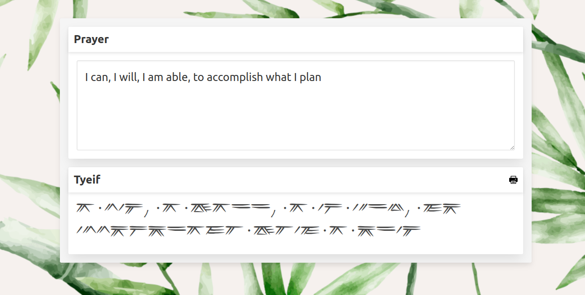

# Tyeif


This app makes writing in the [Tyeif script](https://www.himalayanacademy.com/readlearn/fonts/) simpler; instead of needing to install it as a custom font on the computer, it is loaded as a web font (WOFF) and can be used in the browser. The original TrueType font was converted to WOFF using [cloudconvert](https://cloudconvert.com/).



# Architecture

A straightforward HTML view. Interactivity with vanilla JS (transpiled from the Typescript). The styling uses [Bulma](https://bulma.io/).

```
├── index.html    View
├── assets/       View Assets
│   ├── fonts/
│   ├── images/
│   └── styles/
├── src           App Source
│   └── app.ts
├── modules/      App Build, Imported in index.html view
```

# Development

`npm install` installs Typescript and [ES Module Shims](https://github.com/guybedford/es-module-shims) and copies the shims to the `modules/` (build) directory.

Run the TS build (with `npx tsc` or e.g. `npx tsc --watch`) to output the app to `modules/`

You will need a simple server to [run locally](https://threejs.org/docs/index.html#manual/en/introduction/How-to-run-things-locally). The [Deno std/http file server](https://deno.land/manual@v1.28.0/examples/file_server#using-the-stdhttp-file-server) makes this very easy, i.e. after installing it just run `file_server .` in the directory then open the URL in the browser.
